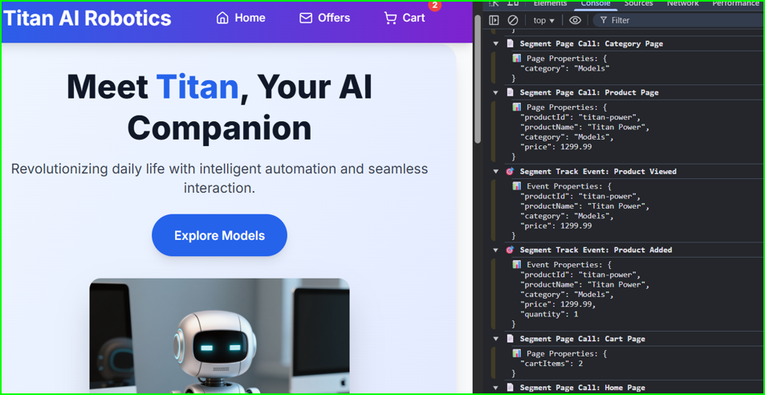

<p align="center">
  
</p>

<p align="center">
  <em>🤖 A modern e-commerce demo showcasing Segment analytics</em>
</p>

<p align="center">
  <a href="#-features">Features</a> •
  <a href="#-live-demo">Live Demo</a> •
  <a href="#-installation">Installation</a>
</p>

<p align="center">
  
  
  
  
</p>

## 🎯 What is Segment Modern eCommerce?

Segment Modern eCommerce is a fully featured demo storefront with Segment analytics at its core. it showcases a modern product catalog, dynamic sizing and options, smooth checkout, and integrated event tracking. The project is designed as both a reference architecture and a playground for experimenting with customer data flows, making it easy to see how Segment can drive real-time insights in an e-commerce experience.

## ✨ Features

### 🛍️ E-commerce Functionality
- **Product Catalog**: Browse AI robots, accessories, subscription modules, and apparel
- **Size & Options**: Dynamic sizing for apparel (Tiny/Boom/Power) and special Neuralink options
- **Product Details**: Detailed product pages with specifications and pricing
- **Shopping Cart**: Full cart management with quantity updates and item removal
- **Checkout Process**: Complete order workflow with confirmation
- **Responsive Design**: Optimized for desktop, tablet, and mobile devices

### 🎬 Enhanced User Experience
- **Hero Video Animation**: Auto-playing video that plays once on home page load (like an animated GIF)
- **Immersive Layout**: Full-width design for engaging shopping experience
- **Interactive Elements**: Smooth animations and hover effects
- **Email Signup**: Dedicated offers page with TitanOffer.png imagery

### 📊 Analytics & Tracking
- **Segment Integration**: Track user interactions, page views, and conversions
- **Event Tracking**: Product views, cart additions, purchases, and user signups
- **User Identification**: Capture user data for personalized experiences
- **Duplicate Prevention**: Smart analytics to prevent duplicate event tracking

### 🎨 Modern UI/UX
- **Tailwind CSS**: Utility-first styling with responsive breakpoints
- **Lucide Icons**: Beautiful, consistent iconography
- **Gradient Backgrounds**: Eye-catching color schemes
- **Smooth Animations**: Engaging hover effects and transitions

## 🚀 Live Demo

**[View Live Demo →](https://segment-modern-ecommerce.vercel.app)**

Experience the full Titan AI Robotics e-commerce platform with all features including:
- Hero video animation
- Dynamic product sizing
- Shopping cart functionality  
- Segment analytics integration
- Mobile-responsive design

## 🛠️ Tech Stack

| Technology | Version | Purpose |
|------------|---------|---------|
| **React** | 19.1.0 | Frontend framework |
| **Vite** | 7.0.6 | Build tool and dev server |
| **Tailwind CSS** | 3.4.17 | Utility-first CSS framework |
| **Lucide React** | 0.525.0 | Icon library |
| **ESLint** | 9.30.1 | Code linting |

## 📦 Installation

### Prerequisites
- Node.js 18.0.0 or higher
- npm 9.0.0 or higher

### Quick Start

1. **Clone the repository**
   ```bash
   git clone https://github.com/islegendary/segment-modern-ecommerce.git
   cd segment-modern-ecommerce
   ```

2. **Install dependencies**
   ```bash
   npm install
   ```

3. **Start development server**
   ```bash
   npm run dev
   ```

4. **Open your browser**
   ```
   http://localhost:5173
   ```
   *Note Uncaught (in promise) Error: A listener indicated an asynchronous response errors, Failed to load resource:, and net::ERR_BLOCKED_BY_CLIENT in console can be ignored and will resolve when you add your Segment writeKey.  Without your writeKey you can view the simulated events using console.

## 🏗️ Build Commands

```bash
# Development server
npm run dev

# Production build
npm run build

# Preview production build
npm run preview

# Lint code
npm run lint
```

## 📱 Product Categories

### 🤖 Models

- **Titan Pint** ($499.99) - Compact desktop AI companion
- **Titan Power** ($1,299.99) - Mobile AI robot for home navigation

### 🔧 Accessories

- Rapid Charging Dock ($79.99)
- Privacy Shield ($29.99)
- Rugged Travel Case ($59.99)
- Enhanced Voice Module ($49.99)

### 📡 Subscription Modules

- Home Security Module ($9.99/month)
- Smart Learning Module ($14.99/month)
- Wellness Assistant Module ($12.99/month)
- Developer API Module ($19.99/month)

### 👕 Apparel

- **Titan Pint T-Shirt** ($24.99) - Available in 3 sizes (Tiny/Boom/Power)
- **Titan Pint Hoodie** ($49.99) - Available in 3 sizes (Tiny/Boom/Power)
- **Titan Power Cap** ($19.99 - $9,999.00) - Adjustable or Neuralink options
- **Titan Power Jacket** ($79.99) - Available in 3 sizes (Tiny/Boom/Power)

> **Note**: All apparel maintains equal pricing across sizes. The Neuralink cap option includes premium neural interface technology.

## 🔧 Configuration

### Segment Analytics Setup

To enable analytics tracking with your own Segment workspace, simply update the write key constant at **line 77** in `src/App.jsx`:

```javascript
const writeKey = "YOUR_SEGMENT_WRITE_KEY_HERE"; // Replace with your actual Segment write key
```

The application comes with Segment integration already configured - you only need to replace the placeholder write key with your actual key from your Segment workspace.

### Environment Variables

Create a `.env` file for environment-specific configuration:

```env
VITE_SEGMENT_WRITE_KEY=your_segment_write_key
VITE_API_URL=your_api_endpoint
```

## 📂 Project Structure

```
segment-modern-ecommerce/
├── public/
│   ├── assets/
│   │   ├── TitanPower.png          # Hero & product images
│   │   ├── TitanVideo.mp4          # Hero animation video
│   │   ├── TitanOffer.png          # Signup page image
│   │   └── ...                     # All product images
│   └── vite.svg
├── src/
│   ├── App.jsx                     # Main application component
│   ├── App.css                     # Custom styles (minimal)
│   ├── index.css                   # Global styles + Tailwind
│   └── main.jsx                    # Application entry point
├── index.html                      # HTML template
├── package.json                    # Dependencies and scripts
├── tailwind.config.js              # Tailwind configuration
├── vite.config.js                  # Vite configuration
└── README.md
```

## 🚀 Deployment

### Vercel (Recommended)

1. **Connect to GitHub**
   ```bash
   git add .
   git commit -m "feat: complete e-commerce platform with video integration"
   git push origin main
   ```

2. **Deploy to Vercel**
   - Connect your GitHub repository to Vercel
   - Vercel will automatically detect it's a Vite project
   - Assets in `/public/assets/` will be served correctly
   - No additional configuration needed

### Other Platforms

The app is production-ready for any static hosting platform:
- **Netlify**: Drag & drop the `dist` folder
- **GitHub Pages**: Use the built files from `dist`
- **AWS S3**: Upload `dist` contents to S3 bucket

### Build Verification

```bash
npm run build    # Creates production build in `dist/`
npm run preview  # Preview production build locally
```

## 🎯 Key Features Implementation

### Hero Video Animation

The homepage features an auto-playing video animation that:

- Plays automatically when users visit the home page
- Runs only once (no looping) like an animated GIF
- Uses `/assets/TitanVideo.mp4` for optimal loading
- Displays alongside the hero image for dynamic visual impact

### Dynamic Product Options

- **Apparel Sizing**: All clothing items offer three sizes (Tiny, Boom, Power) at equal pricing
- **Special Options**: Titan Power Cap includes premium Neuralink option ($9,999.00)
- **Smart Validation**: Size selection required before adding to cart
- **Price Display**: Automatic price range calculation for variable-priced items

### Vercel-Optimized Asset Management

- All images moved to `/public/assets/` for production compatibility
- Static assets served directly from root URL in deployment
- No build processing required for images and videos
- Universal development/production compatibility

### Full-Width Shopping Cart

The cart page utilizes the entire browser width for an immersive shopping experience:

- Removed flexbox centering constraints
- Used `w-screen` for true viewport width
- Optimized for all screen sizes

### Responsive Design

- Mobile-first approach with Tailwind CSS
- Responsive grid layouts for product catalogs
- Adaptive navigation and UI components

### Analytics Tracking

- Page view tracking for all routes
- Product interaction events
- Cart and checkout conversion tracking
- User signup and identification

## 🤝 Contributing

1. Fork the repository
2. Create a feature branch (`git checkout -b feature/amazing-feature`)
3. Commit your changes (`git commit -m 'Add amazing feature'`)
4. Push to the branch (`git push origin feature/amazing-feature`)
5. Open a Pull Request

## 📄 License

This project is licensed under the MIT License - see the [LICENSE](LICENSE) file for details.

## 🙏 Acknowledgments

- [React](https://reactjs.org/) for the frontend framework
- [Vite](https://vitejs.dev/) for the blazing fast build tool
- [Tailwind CSS](https://tailwindcss.com/) for the utility-first CSS framework
- [Lucide](https://lucide.dev/) for the beautiful icons
- [Segment](https://segment.com/) for analytics infrastructure

---

**Built with ❤️ for the future of AI robotics**

   Your application will be available at `http://localhost:5173`.

For detailed setup instructions, including Segment integration, please see [SETUP.md](SETUP.md).


